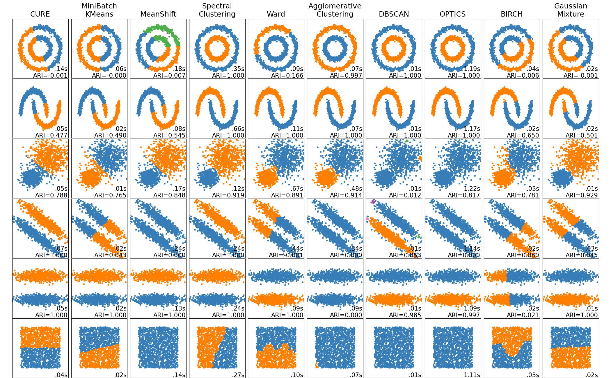

# CURE
This repository implements the clustering algorithm Clustering via Uncoupled  REgression (CURE) from Wang's paper [Efficient Clustering for Stretched Mixtures: Landscape and Optimality](https://arxiv.org/abs/2003.09960). It also conducts several experiments to benchmark the performance of CURE.

### Table of Contents
1. [Explanation](https://github.com/ez2rok/cure/blob/master/README.md#explanation)
2. [Coding Overview](https://github.com/ez2rok/cure/blob/master/README.md#coding-overview)
3. [Experiments](https://github.com/ez2rok/cure/blob/master/README.md#experiments)

# Explanation

### Motivation
Many traditional clustering algorithms struggle to cluster elliptically distributed data. K-Means, for example, assumes the data is spherically distributed and performs poorly when data is elliptically distributed. CURE seeks to solve this problem by creating a clustering algorithm that excels at clustering elliptically distributed data.

### Loss Function

CURE seeks to find the weights that minimize the loss function

</>

where 
     
are the weights, 
    
are the optimal weights that minimize the above equation, 
    
is a sample data point with 
    
features, 
    
is a matrix of 
    
datapoints each with
    
features, and 
    
is the value of the average data point. To get 
    
we preappend a column of ones 
    
to the data (which is really 
    
) to give us an intercept term. 

The discriminative function  is defined as

&space;b&space;&space;&space;&space;&space;&space;&space;&space;\\&space;&space;&space;&space;\end{cases}" title="f(x)=\begin{cases} h(x) & |x| \leq a \\ f(a) + h'(a) (|x| - a) + \frac{h''(a)}{2} (|x| - a)^2 - \frac{h''(a)}{6(b-a)} (|x| - a)^3 & a < |x| \leq b \\ f(b) + \Big[ h(a) + \frac{b-a}{2} h''(a) \Big] (|x| - b) & |x| > b \\ \end{cases}" />
</>

where 
    &space;a&space;>&space;1" title="b > a > 1" />
and 
    
.

We embed the data
     
into 1D space via the dot product

. Then we plug
     
into the discriminative function
     
to separate, ie. discriminate, the embedded data into two clusters. How does this work?
     
and
     
both have minimums at both
     
=±1 so minimizing these equations will map many of our datapoints to
     
and many of them to
     
, resulting in two different clusters. Because
     
becomes huge for large
     
values (
     
is quartic), we construct
     
which is just like
     
except that when
     
is too big we clip its growth with linear functions. More explitically,
     
has three parts. When
     
is small, 
     
, we will minimize
     
which has two valleys around ±1. When
     
is too big,
     &space;b" title="|x| > b" />
, we will minimize a linear function so our values don't blow up. When
     
is somewhere in between,
     
, we use a cubic spline to connect the valleys to the linear function.

    

So
     
embeds the data
     
in 1D space and computes on average how well the data is separated into two clusters located at 
     
=±1. The lower this value, the better. However, we can minimize this function by clustering all of the datapoints into a single cluster. To avoid this trivial solution, we use the penalty term
     
. This term encourages the data
     
to be evenly split between the two clusters at
     
=±1 as this term has the lowest value when
     
which only occurs when the data is evenly split between both clusters. 

Putting it all together, the loss function embeds the data
     
in 1D space and computes on average how well the data is separated into two evenly sized clusters located at x=±1. We minimize this score and record the weights,
     
, that result in this minimization.

### Clustering
Once we have computed
     
, the clustering comes into play:
     
where
     
is the predicted label of the
     
th sample for all datapoints
     
. The 
     
function puts all positive datapoints into one cluster and all negative datapoints into a different cluster. And these are our clusters! That's it.

# Coding Overview

I designed CURE so it resembles many of the classifiers in `scikit-learn`. And I did this by creating a `cure` class with `__init__` and three methods.

#### \_\_init__
When you initialize the class, you specify the the random seed and the parameters `a, b`.

#### fit()
When you call `fit`, it returns the weights that result in the best performance by minimizing the loss function. It relies upon `scipy`'s minimization function.

#### predict()
When you call `predict`, it uses the weights computed in `fit` to predict a label for each datapoint. It uses the equation
     
.

#### fit_predict()
This calls both `fit` and `predict` on the training data.

# Experiments

### Experiment 1
For our first experiment, let's use CURE to cluster some elliptically distributed data. 

  True Clustering | CURE Clustering
  ------------- | -------------
   |  
  
From these two plots, it seems like CURE pretty perfectly predicts which datapoint belongs to which cluster. This is a great visual check that everything is working.

Next, we look at the adjusted rand index (ARI), a measure of the similarity between two different data clusterings (here, 

and 
     
for all datapoints
     
) that is adjusted for the chance grouping of elements. This is the clustering analogue for accuracy with a lower bound of -1 and an upper bound of 1; an ARI of 0 corresponds to the average clustering, ie a random guess. Our clustering achieved an adjusted rand index of 0.98 which is pretty great!

And finally we have the misclassification rate which is a tiny 0.4% or 0.004. It seems like we may have made a few incorrect predictions by the border between the data. Nonetheless, CURE clearly does a great job of clustering on this elliptically distributed data.

### Experiment 2
Experiment 2 compares the performance of CURE and many other clustering algorithms on various datasets.

     

The clustering algorithms tested are:
1. CURE
2. KMeans
3. Meanshift
4. Spectral clustering
5. Ward
6. Agglomerative Clustering
7. DBSCAN
8. OPTICS
9. BIRCH
10. Gaussian Mixture

Then for every dataset and algorithm, I recorded the time it took for the algorithm to run and the Adjusted Rand Index (ARI). 

#### A couple of observations:
1. CURE had near-constant runtime, regardless of the distribution of the data.
2. CURE achieved perfect classification on the two elliptically distributed datasets. In other words, it did exactly what it was suppossed to do.
3. CURE only performed well on clusters that were linearly seperable, ie it performed quite poorly on the first two datasets. This suggests that CURE might only work well on data with a linear decision boundary.
4. Generally speaking, CURE was on par with the rest of the well known clustering algorithms. However, Spectral Clustering performed the best overall.
     
   
     
### Animation of CURE     
     

    

